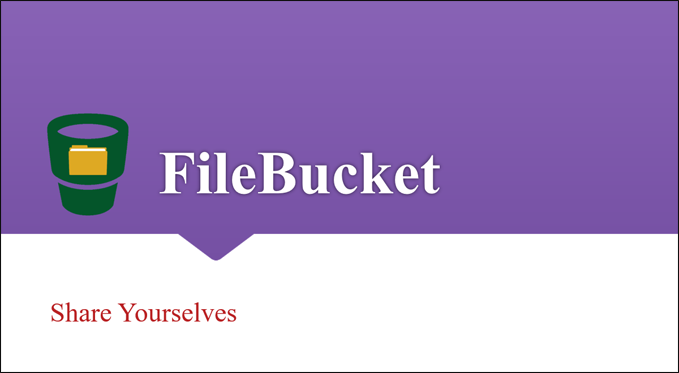
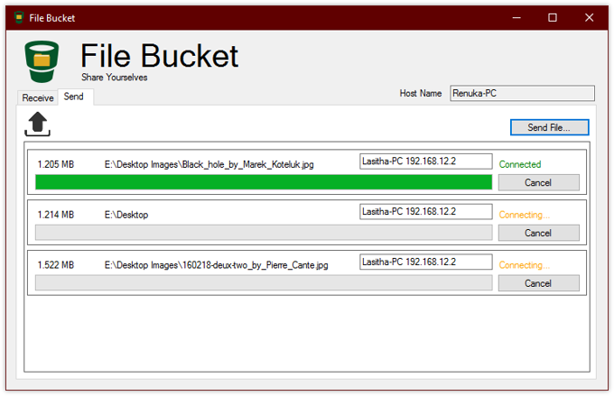
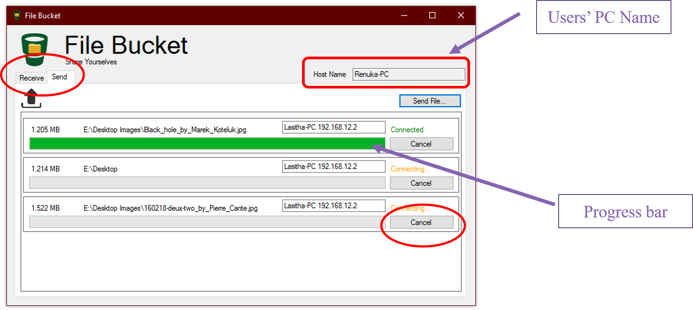
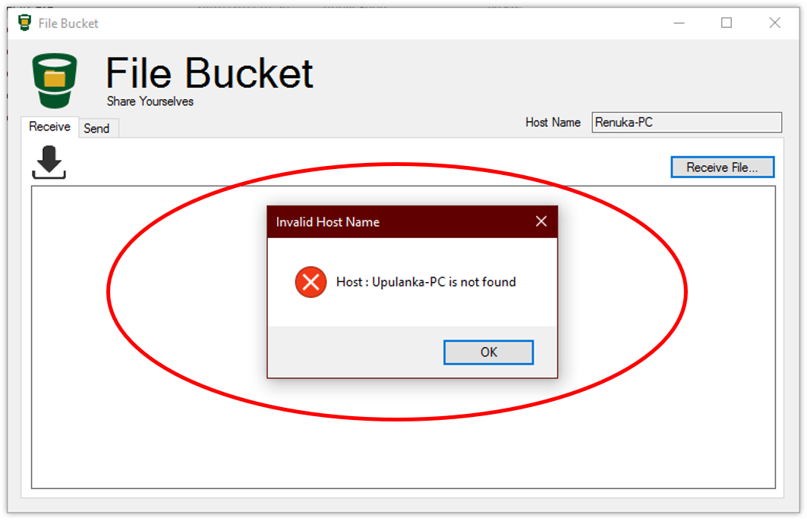
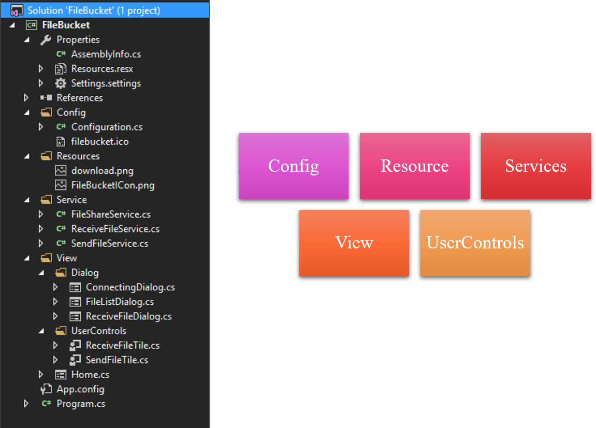

# File Bucket
**File Bucket** is a simple programme written in *C#* for sharing files with **Peer-to-peer** communication.

## 1 Peer-to-Peer Network
Peer-to-peer (P2P) is a decentralized communications model in which each party has the same capabilities and either party can initiate a communication session. Unlike the client/server model, in which the client makes a service request and the server fulfil the request, the P2P network model allows each node to function as both a client and server.

## 2 Features
### 2.1 Basic Features
You can easily share your files with sending and receiving simultaiously using **File Bucket**. Your host name is displayed and can be used to receive your shared files by others.

The progressbar indicates the propotion the file being received or sent. The state of the connection is shown and you can cancel the process of receiving or sending any time.

### 2.2 Host not Found

## 3 Architecture of File Bucket

## 3.1 Services
Main services for send and receive files are resides in this namespace.
## 3.2 Views
User-Interface elements are resides in this namespace.
- Dialog Boxes
- Customer User Controls
## 3.3 User Controls
Customer User Controls for showing send and receive files are implemented as tiles. These are a composite of progressbar, labels and cancel button.
## 3.4 Resources
Resource such as images.
## 3.5 Configs
Configurations such as Port numbers.